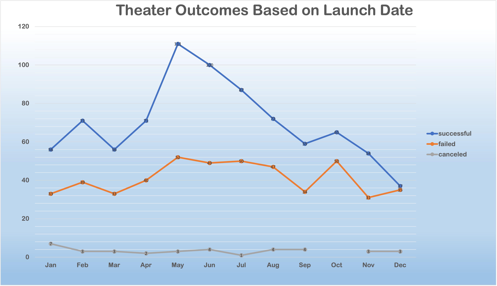
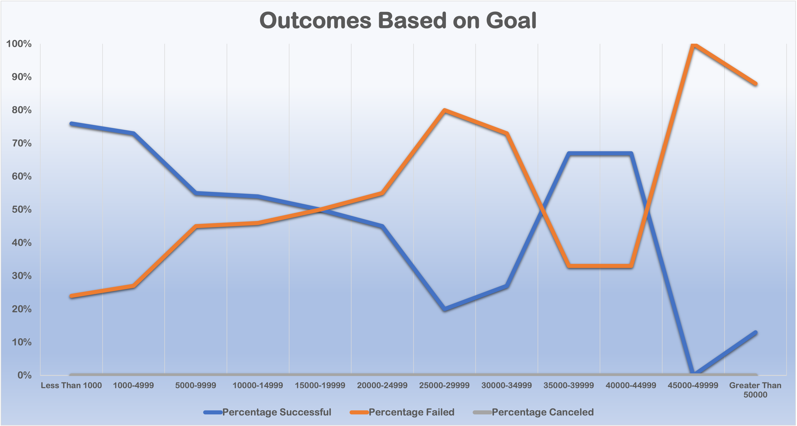
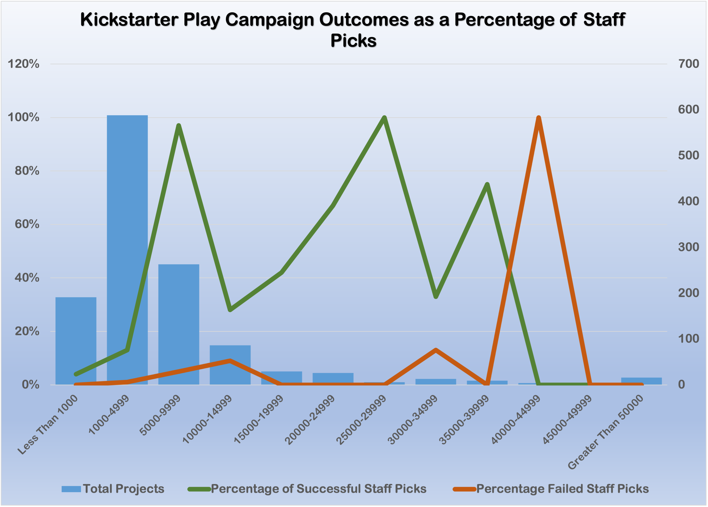
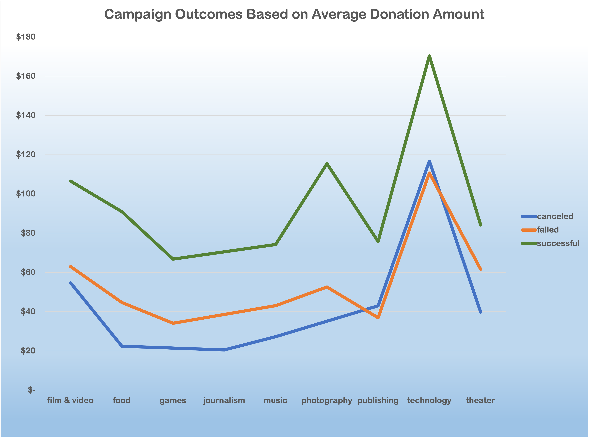

# Kickstarting with Excel

## Overview of Project

### Overview

Kickstarter in an online platform that allows individuals or groups to promote their idea to obtain funding from anyone interested in the idea.  The project is introduced in a campaign that summerizes the project and has a target donation goal that will allow the project to be successfully launched.  A campaign that meets its goal has access to the funds donated and those that do not the funds donated are returned to the donor.  Based on this the success of a campaign is important to the ability of these projects to be launched.

### Project summary
Based on this we conducted the analysis for a client who is interested in starting a Kickstarter campaign to launch the play _Fever_ to generate startup funds for the project.  Our client wants insight on what factors have a positive impact on the success of a campaign and allows it to meet its target goal.  For this we utilized data collected from Kickstarter of all the campaigns launched on the platform from 2007 to 2017.  This data gave us a summary of each project based on the categories, goals, startdates and outcomes which we used to create an analysis to determine some of the factors that were common in successful campaigns and give guidelines that we hope will increase the probability of success for the launch of the play.

___
## Analysis and Challenges

### Analysis of Outcomes Based on Launch Date

Using the data collected we looked at trends of the campaign outcomes based on the date that the campaign was launched.  This analysis looked at all the campaigns over the 10 year period focusing on the start date and the broad category of the campaigns were classified within.  The campaigns were summarized based on the month of the launch and a count of the successful, failed and canceled campaigns.  From this data we created the following chart:

### Analysis of Outcomes Based on Goals

Using the same dataset the trends of the outcome of Kickstarter campaigns based on the goal amount that was targeted for the project.  This analysis was focused on theater projects that were launched in a campaign which includeds plays within the main category.  The campaigns were summarized on the basis of the outcome of the campaign and the value of the target goal required to meet the target.  Based on this date the following chart was developed:

### Challenges and Difficulties Encountered

The analysis of the data collected from Kickstarter was provided in tabular format which allowed us to use the power of Excel to analyse to identify trends that where contained within the data.  On of the challenges faced was ensuring that the visualization of the data was clear and showed the trends based on the graphs developed.  This required determining what style and type of graph to use.  In the case of using multiple data sets within the same graph challenges in making the information clear and easy to interprete for the reader.  In some cases changing the data type from bar to line or visa versa could change the ease of the analysis and make the trends more visable.  Another challange was the manipulation of the data to show it in a form or range that is more managable and more accurately reflects the data in a form that answers the question being added.  An example of this was the grouping of the campaign outcomes based on the value of the goal.  To make the data more clear the outcomes were grouped together based on the range of values. This required a combination of multiple logic arguement and calculations to successfully group the outcomes within a new chart.  Finally was the number of workbooks required for the various analysis.  For most of the analysis a new workbook was needed to summarize the data which required organization and clear labeling to keep each analysis clear for the user.

___
## Results

### Conclusions for Campaign Outcomes Based on Launch Date

From the analysis of the theater campaigns launched on Kickstarter trends based on the launch data were observed.

* The greatest number of successful of theater campaigns were observed during the month of May.
    * The data collected shows that there is a higher number of theater campaigns launched between May and July
    * There is a higher proportion of successful campaigns during this period with the peak of the number of campaigns being launched and the success of the campaign observed in May
    * The least successful months for starting theater campaigns is in the November and December
        
* Theater campaigns are generally have a greater number of successful campaigns than failed campaigns.
    * Regardless of the number of theater campaigns launched there is a greater number of successful campaigns than failed.
    * The number of failed campaigns is relatively consistant regardless of the number of campaigns being launched.
    
The analysis of the data based on the launch date of theater campaigns shows there there is a higher probability of the success of the campaign to reach its target goal. For the launch of the campaign to fund the play _Fever_ it is advisable that the targeted launch for the play be targeted in May to increase the probability of successfully meeting the target goal and avoid a launch in the later part of the year.
   
___

### Conclusions for Campaign Outcomes based on Goal Amounts

The analysis of the success of play campaigns based on the amount targeted for the goal revealed the following observations.

* The proportion of successful campaigns were higher where the target goal amount was less than $20,000.00
    * As the values increased the number of campaigns that were successful rapidly dropped below 50%
    * Wide variation in the percentage of successful and failed campaign as the goal amount increased beyond $30,000
    
* The greatest number of campaigns had goals between $1000.00 and $5000.00 with the greatest success between $1.00 and $5000.00
    * Lower targeted goals are easier to reach and allow campaign to access funds.
    * Kickstarter can be used to increase visibility of the campaign as a potential publicity tool.
    
Based on the finding of the analysis of the Kickstarter campaigns outcomes in relation to the targeted goal amount the target goal should be restricted to less than $20000.00.  The lower campaign goals have a higher proportion of success and also provide publicity on the Kickstarter website.

### Limitations

The analysis of the Kickstarter data did show some trends for the successful launch of the a fundraising campaign using this platform.  The dataset however does have some limitations.  The quality of the campaigns material used to highlight the project cannot be determined from the data.  Additionally the type of plays being promoted (eq. comedy vs drama) is not evident within the dataset being used.  This factors can have a significant impact on the outcome of the campaign.

### Other possible data that could be used for the analysis

From the dataset used there are some additional graphs that could be created to give more insight into the strategy of the launch of the _Fever_ campaign.

1. Analysis of the outcome of campaigns based on the staff pick status
    * Provided some insight into the quality of the campaign
    * Staff picks must meet the following crtieria[^1]:
        * Start with a strong idea — and express it clearly
        * Choose a compelling project image
        * Put the essential information first
        * Show, don’t (just) tell
        * Show your rewards
        * Remember your audience
        * Don’t spam

[^1]: <https://www.crowdcrux.com/become-kickstarter-staff-pick/

2. Analysis of the outcome of campaigns based on the average donation amount for campaigns
    * Provide a guideline for creating incentives used during the Kickstarter campaign
    * Can give a benchmark during the campaign to see determine the likelyhood of success based on donation amounts.
    

